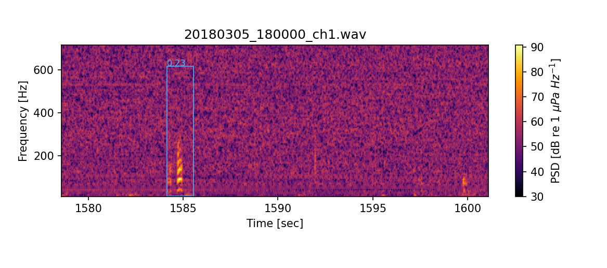
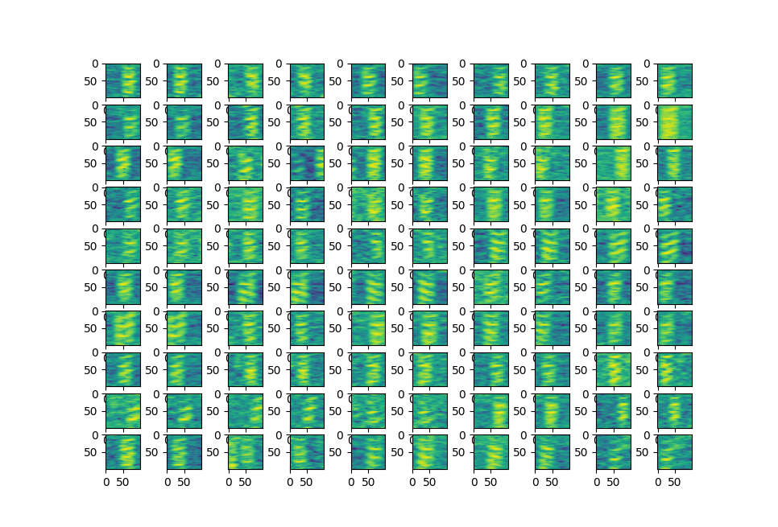
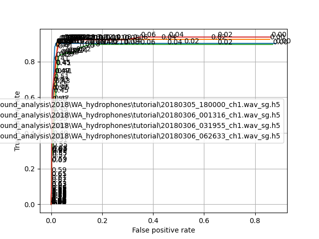
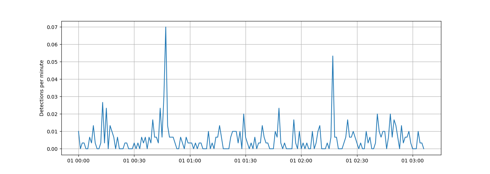

# Detecting cod sounds with neural networks





## Converting audio file into tensorflow image matrices

This code uses all cores to convert audio files to hdf files (.h5) 

```python
# -*- coding: utf-8 -*-
"""
Created on Tue Jan 17 13:49:47 2023

@author: Administrator
"""

# -*- coding: utf-8 -*-
"""
Created on Wed Jan 11 12:11:58 2023

@author: Administrator
"""


import h5py
import pandas as pd
import numpy as np
import glob 
import os
import scipy.io.wavfile as wav
from scipy import signal

from skimage.transform import  resize
from functools import partial
import multiprocessing  


#%%


def parafunc(afiles,window=3,overlap= 0.2,fftsize=16000,fmin=10, fmax=120,fileindex=0):
    
    name= afiles[fileindex]
    
    if not os.path.isfile(  os.path.basename(name)+'_sg.h5' ):
        print(name)
      
        # name='20180306_062633.wav'
        fs, p = wav.read(name)
        
        os.path.basename(name)[:-4]
        
            
        reclength= len(p)/fs
        
        # window = 3 #s
        # overlap= 0.2
        # fftsize=16000
        # fmin=10
        # fmax=120      
        npix=100
        
        t1=np.arange(0,reclength-window,window*overlap)
        t2=t1+window
        
        # t1_datetime= starttime + pd.to_timedelta(t1,'s')
        # t2_datetime= starttime + pd.to_timedelta(t2,'s')
        
        x=p[  int(fs*t1[0]) : int(fs*t2[0])]   
        f, t, Sxx = signal.spectrogram(x, fs, window='hamming',nperseg=fftsize,noverlap=int(fftsize*0.9))
        ixf = (f>= fmin) & (f<fmax)
        db=10*np.log10(Sxx)
        ixf = (f>= 10) & (f<200)
        
        db = resize( db[ixf,:], [npix,npix])        

        # plt.figure(8)
        # plt.clf()
        # plt.subplot(311)
        # plt.imshow(db,aspect='auto')
        # plt.subplot(312)
        # plt.imshow(db_m,aspect='auto')
        # plt.subplot(313)
        # plt.imshow(db-db_m ,aspect='auto')
        
        x_train_sg=np.empty( [len(t1) ,    npix,npix,1])
        
        for ix in range(len(t1)):
            
            x=p[  int(fs*t1[ix]) : int(fs*t2[ix])]
            f, t, Sxx = signal.spectrogram(x, fs, window='hamming',nperseg=fftsize,noverlap=int(fftsize*0.9))
            db=10*np.log10(Sxx)        
            ixf = (f>= fmin) & (f<fmax)
            
            db = resize( db[ixf,:], [npix,npix])        
            db_m=  np.transpose( np.tile( np.mean(db,axis=1) ,(db.shape[1],1) ) )
            db=db-db_m 
     
            # if np.shape(db) is not  np.shape(x_train_sg)[1:2]:
            #     db = resize( db, [np.shape(x_train_sg)[1],np.shape(x_train_sg)[2]])        
            x_train_sg[ix,:,:,0]= (db  - db.min() ) /(db.max() - db.min())
        
        
        # os.mkdir('training_fw')
        h5f = h5py.File(  os.path.basename(name)+'_sg.h5', 'w')    
        h5f.create_dataset('x_train_sg', data=x_train_sg)
        h5f.create_dataset('t1', data=t1)
        h5f.create_dataset('t2', data=t2)
        h5f.create_dataset('window', data=window)
        h5f.create_dataset('overlap', data=overlap)
        h5f.create_dataset('fftsize', data=fftsize)
        h5f.create_dataset('fmin', data=fmin)
        h5f.create_dataset('fmax', data=fmax)
        h5f.create_dataset('npix', data=npix)
        h5f.close()
        


#%%

if __name__ == '__main__':
    
    os.chdir(r'F:\cod_sound_analysis\2018\WA_hydrophones\tutorial')

    audio_folder=r'F:\cod_sound_analysis\2018\WA_hydrophones\tutorial\*.wav'
    audiopath_list=glob.glob(audio_folder)
    
    print(audiopath_list)
        
    cpucounts=multiprocessing.cpu_count()
    
    print(cpucounts)
    
    pool = multiprocessing.Pool(processes=cpucounts)
    index_list=range(len( audiopath_list ))
    pool.map( partial( parafunc,audiopath_list,1,0.2,15000,10,200), index_list)
    pool.close   
    

```


For the cod sound detection, use these parameters for parafunc:

window= 1 second

overlap= 0.

fft size=15000

fmin= 10 hz

fmax=200 hz


## Training tensorflow network

Here 2 files are sud for training and the other two for validation.

here are some example of frames annotated as cod grunts:



```python


import h5py
import pandas as pd
import numpy as np
import matplotlib.pyplot as plt
import datetime as dt
import glob 
import os
import sys
import scipy.io.wavfile as wav
import scipy.io
from scipy import signal
import tensorflow as tf

import random
from skimage.transform import  resize

# (x_train, y_train), (x_test, y_test) = tf.keras.datasets.mnist.load_data()

#%% load training data


os.chdir(r'F:\cod_sound_analysis\2018\WA_hydrophones\tutorial')

#%% file 1
name='20180305_180000_ch1.wav'

df=pd.read_csv(name[:-8]+'.csv')
t_ann=df['tmin'] + (df['tmax']-df['tmin'])*0.5


h5f = h5py.File(os.path.basename(name)+'_sg.h5','r')
x_train_sg = h5f['x_train_sg'][:]
t1 = h5f['t1'][:]
t2 = h5f['t2'][:]
window = h5f['window'][()]
overlap = h5f['overlap'][()]
h5f.close()

score_train=np.zeros(len(t1))
for ix in range(len(t1)):      
    sumcall =   np.sum( (t_ann>=t1[ix]+window*0.3) & (t_ann<t2[ix]-window*0.3) ) 
    if sumcall>0:
        score_train[ix]=1
            
np.sum(score_train)       


# plt.figure(2)
# plt.clf()
# k=1
# for ixs in np.where(score_train==True)[0]:
#     plt.subplot(10,10,k)
#     k=k+1
#     plt.imshow( x_train_sg[ixs,:,:,0] )

# plt.tight_layout()


#%% file 2
name='20180306_001316_ch1.wav'

df=pd.read_csv(name[:-8]+'.csv')
t_ann=df['tmin'] + (df['tmax']-df['tmin'])*0.5


h5f = h5py.File(os.path.basename(name)+'_sg.h5','r')
x_train_sg_2 = h5f['x_train_sg'][:]
t1 = h5f['t1'][:]
t2 = h5f['t2'][:]
window = h5f['window'][()]
overlap = h5f['overlap'][()]
h5f.close()

score_train_2=np.zeros(len(t1))
for ix in range(len(t1)):      
    sumcall =   np.sum( (t_ann>=t1[ix]+window*0.3) & (t_ann<t2[ix]-window*0.3) ) 
    if sumcall>0:
        score_train_2[ix]=1
            
np.sum(score_train_2)       


# plt.figure(3)
# plt.clf()
# k=1
# for ixs in np.where(score_train_2==True)[0]:
#     plt.subplot(10,10,k)
#     k=k+1
#     plt.imshow( x_train_sg[ixs,:,:,0] )

# plt.tight_layout()

#%%

#%%

st =np.concatenate([score_train,score_train_2])

xt =np.concatenate([x_train_sg,x_train_sg_2],axis=0)

#%%


ix_score = np.where(st==True)[0]
ix_noscore = np.where(st==False)[0]
ix_random= random.sample( list(ix_noscore) , len(ix_score)*3 )

x_train_new=xt[ix_score,:,:,:]
x_train_new = np.concatenate([x_train_new,  xt[ix_random,:,:,:]] ,axis=0)
score_train_new =  np.concatenate([ np.ones(len(ix_score)) , np.zeros(len(ix_random)) ])

#%%


input_shape = (100, 100, 1)


# Importing the required Keras modules containing model and layers
from tensorflow.keras.models import Sequential
from tensorflow.keras.layers import Dense, Conv2D, Dropout, Flatten, MaxPooling2D
# Creating a Sequential Model and adding the layers
model = Sequential()
model.add(Conv2D(28, kernel_size=(3,3), input_shape=input_shape))
model.add(MaxPooling2D(pool_size=(2, 2)))
model.add(Flatten()) # Flattening the 2D arrays for fully connected layers
model.add(Dense(128, activation=tf.nn.relu))
model.add(Dropout(0.2))
model.add(Dense(2,activation=tf.nn.softmax)) # nr of output categories

model.summary()

model.compile(optimizer='adam', 
              loss='sparse_categorical_crossentropy', 
              metrics=['accuracy'])
# model.fit(x=x_test_sg,y=score_test, epochs=10)

model.fit(x=x_train_new,y=score_train_new, epochs=20)


# model.evaluate(x_train_sg, score_train)

pred = model.predict( x_train_sg )
score=score_train

score_predict= pred.argmax(axis=1)

tpr= np.sum( (score_predict==1) & (score==1)) / np.sum(score)

fpr= np.sum( (score_predict==1) & (score==0)) / np.sum( score==0 )

print('tpr '+str(tpr) + ' fpr '+str(fpr))
#%%

model.save('cod_grunt_tensorflow')

#%%

```


## Running the tensorflow CNN over the .h5 files:

```python
# -*- coding: utf-8 -*-
"""
Created on Tue Jan 17 14:11:15 2023

@author: Administrator
"""

import h5py
import pandas as pd
import numpy as np
import matplotlib.pyplot as plt
import datetime as dt
import glob 
import os
import sys
import scipy.io.wavfile as wav
import scipy.io
from scipy import signal
import tensorflow as tf

import random
from skimage.transform import  resize
from functools import partial
import multiprocessing  

import tensorflow as tf
#%%
os.chdir(r'F:\cod_sound_analysis\2018\WA_hydrophones\tutorial')
    

model_cnn  = tf.keras.models.load_model('cod_grunt_tensorflow')


# audio_folder=r'F:\cod_sound_analysis\2018\WA_hydrophones\tutorial'
audiopath_list=glob.glob('*.wav_sg.h5')

index=0
for index in range(len( audiopath_list )) :
    name=audiopath_list[index]
    
    h5f = h5py.File(name,'r')
    x_train_sg = h5f['x_train_sg'][:]
    t1 = h5f['t1'][:]
    t2 = h5f['t2'][:]
    window = h5f['window'][()]
    overlap = h5f['overlap'][()]
    h5f.close()
    
    pred = model_cnn.predict( x_train_sg )    
    # score_predict= pred[pred.argmax(axis=1)]

    
    dfd=pd.Series(pred[:,1])
    slider = int(window/(window*overlap))
    # score = dfd.rolling(slider,center=True).sum() /5
    score = dfd.rolling(slider,center=True).mean() 
    score.index= pd.to_timedelta(t1 + window*0.5 ,'s') 

    score.to_csv(name[:-10]+'_cnn_detections.csv')

```


## Analyzing detector performance 

This calculates the ROC curve for all audio files (training and validation). Use the two validation files to get the optimal threshold (in this case its around 0.4 )

```python
# -*- coding: utf-8 -*-
"""
Created on Tue Jan 17 14:10:08 2023

@author: Administrator
"""


import h5py
import pandas as pd
import numpy as np
import matplotlib.pyplot as plt
import datetime as dt
import glob 
import os


from scipy.signal import find_peaks


#%%
plt.figure(8)
plt.clf()


audio_folder=r'F:\cod_sound_analysis\2018\WA_hydrophones\tutorial'
audiopath_list=glob.glob(audio_folder+'\*.wav_sg.h5')

index=0
for index in range(len( audiopath_list )) :
    name=audiopath_list[index]
    
    h5f = h5py.File(name,'r')
    t1 = h5f['t1'][:]
    t2 = h5f['t2'][:]
    window = h5f['window'][()]
    overlap = h5f['overlap'][()]
    h5f.close()
    
    score = pd.read_csv(name[:-10]+'_cnn_detections.csv',index_col=0  )
    score.index= pd.to_timedelta(score.index)

    reclength = score.index.total_seconds().max()-overlap

    df=pd.read_csv(name[:-14]+'.csv')
    t_ann=df['tmin'] + (df['tmax']-df['tmin'])*0.5
    
    
    t1=np.arange(0,reclength-window,window)
    t2=t1+window
    
    score_annotation=np.zeros(len(t1))
    for ix in range(len(t1)):      
        sumcall =   np.sum( (t_ann>=t1[ix]) & (t_ann<t2[ix]) )
        if sumcall>0:
            score_annotation[ix]=1
            
    np.sum(score_annotation)       
    
    n=50
    
    tr = np.linspace(0,1,n)
    fpr=np.empty(n)
    
    tpr=np.empty(n)
    i=0
    for threshold in tr: 
        
        ix_p,b= find_peaks(score['0'].values,height=threshold)
        # score_detector=np.zeros(len(t1))
        # score_detector[ix_p] = 1
        t_det = score.index[ix_p].total_seconds()
    
        score_detector=np.zeros(len(t1))
        for ix in range(len(t1)):      
            sumcall =   np.sum( (t_det>=t1[ix]) & (t_det<t2[ix]) )
            if sumcall>0:
                score_detector[ix]=1    
            
        
        tpr[i]= np.sum( (score_detector==1) & (score_annotation==1)) / np.sum(score_annotation)
        
        fpr[i]= np.sum( (score_detector==1) & (score_annotation==0)) / np.sum( score_annotation==0 )
        i=i+1
        # print('tpr '+str(tpr) + ' fpr '+str(fpr))    
    df_roc=pd.DataFrame([])
    df_roc['fpr']=fpr
    df_roc['tpr']=tpr
    df_roc['threshold']=tr
    df_roc.to_csv(name[:-8]+'_roc.csv')
    
    plt.plot(fpr,tpr,label=name)
    for i, txt in enumerate(tr):
        plt.annotate("{:.2f}".format(txt), ( fpr[i] , tpr[i]))


plt.ylabel('True positive rate')
plt.xlabel('False positive rate')
plt.grid()
       
# plt.legend()

plt.savefig('roc.png')

```



Based on this a detection threshold of 0.4 works best. To put this into us for other audio files follow this:

## Applying detector

To now use the correct detection threshold with the CNN predictions, run this over the .h5 files :

```python
# -*- coding: utf-8 -*-
"""
Created on Tue Jan 17 14:46:12 2023

@author: Administrator
"""


import h5py
import pandas as pd
import numpy as np
import matplotlib.pyplot as plt
import datetime as dt
import glob 
import os

import tensorflow as tf
from scipy.signal import find_peaks


#%%
os.chdir(r'F:\cod_sound_analysis\2018\WA_hydrophones\tutorial')
    

model_cnn  = tf.keras.models.load_model('cod_grunt_tensorflow')


# audio_folder=r'F:\cod_sound_analysis\2018\WA_hydrophones\tutorial'
audiopath_list=glob.glob('*.wav_sg.h5')

index=0
for index in range(len( audiopath_list )) :
    name=audiopath_list[index]
    
    h5f = h5py.File(name,'r')
    x_train_sg = h5f['x_train_sg'][:]
    t1 = h5f['t1'][:]
    t2 = h5f['t2'][:]
    window = h5f['window'][()]
    overlap = h5f['overlap'][()]
    h5f.close()
    
    pred = model_cnn.predict( x_train_sg )    
    # score_predict= pred[pred.argmax(axis=1)]

    
    dfd=pd.Series(pred[:,1])
    slider = int(window/(window*overlap))
    # score = dfd.rolling(slider,center=True).sum() /5
    score = dfd.rolling(slider,center=True).mean() 
    score.index= pd.to_timedelta(t1 + window*0.5 ,'s') 
    
    
    detections=pd.DataFrame()
    detections.index= score.index
   
    detections['cod']=0
  
    threshold = 0.4   
    ix_peaks , b =  find_peaks(score.values,height=threshold)
    detections.iloc[ix_peaks,0]=1
   
    a = detections['cod'].resample('1min').mean()
    a.index=pd.Timestamp(2000,1,1) + a.index
    
    plt.figure(0)
    plt.clf()
    plt.plot( a)
    plt.grid()
    plt.ylabel( 'Detections per minute' )
    plt.savefig(name[:-10]+'_detections.png')

    detections.to_csv(name[:-10]+'_detections.csv')
```

